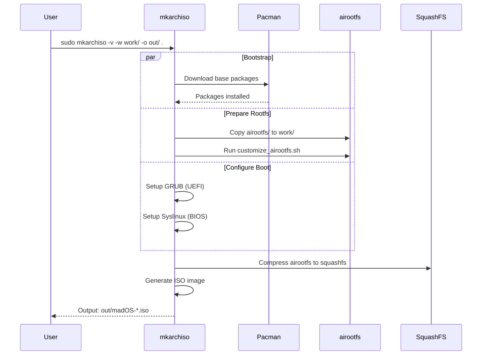
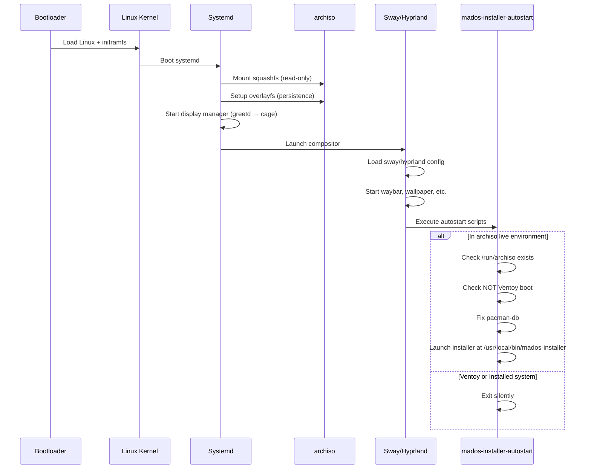
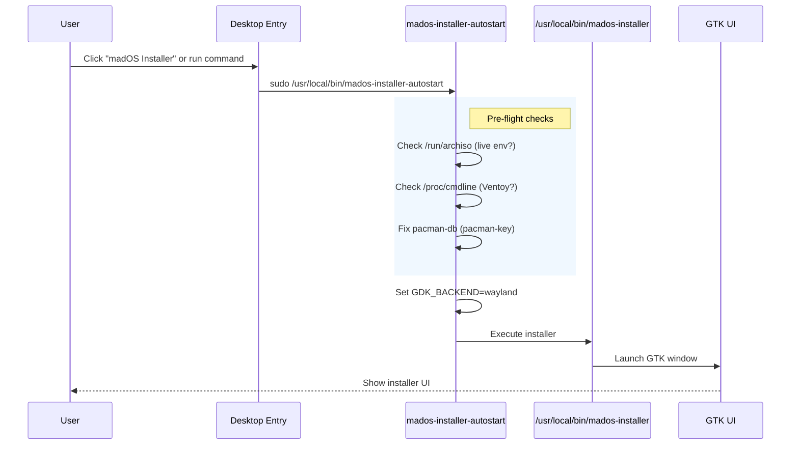
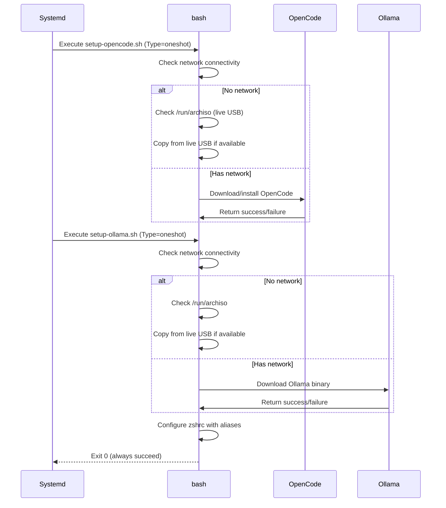
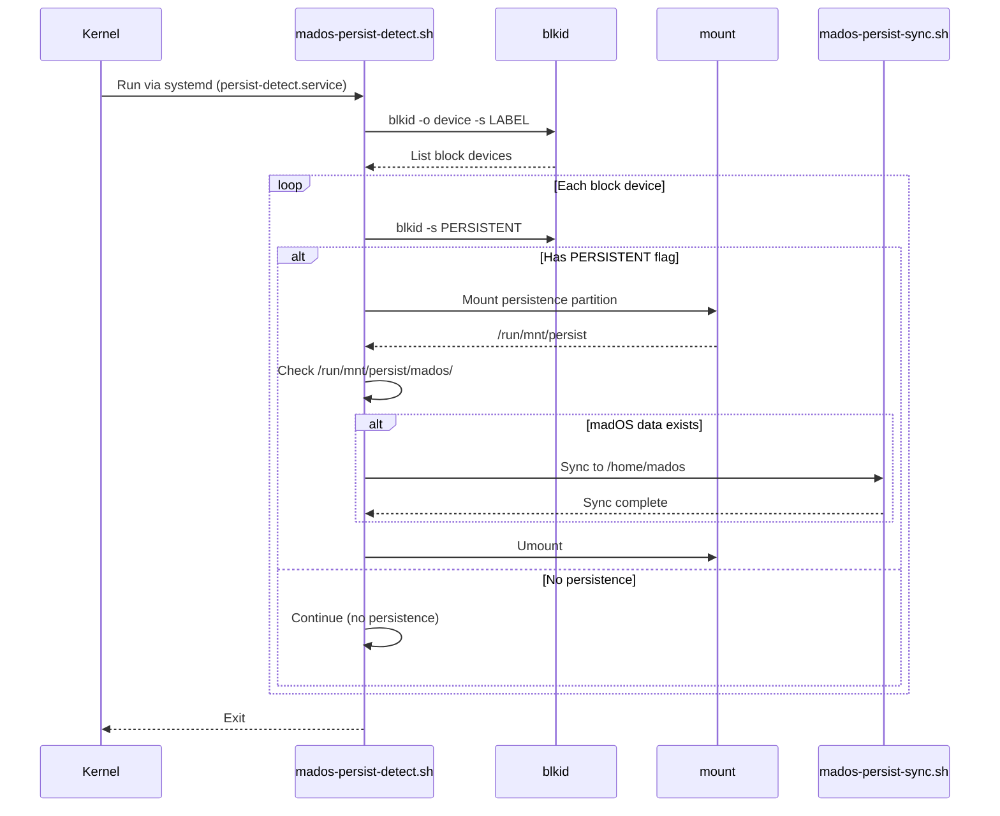
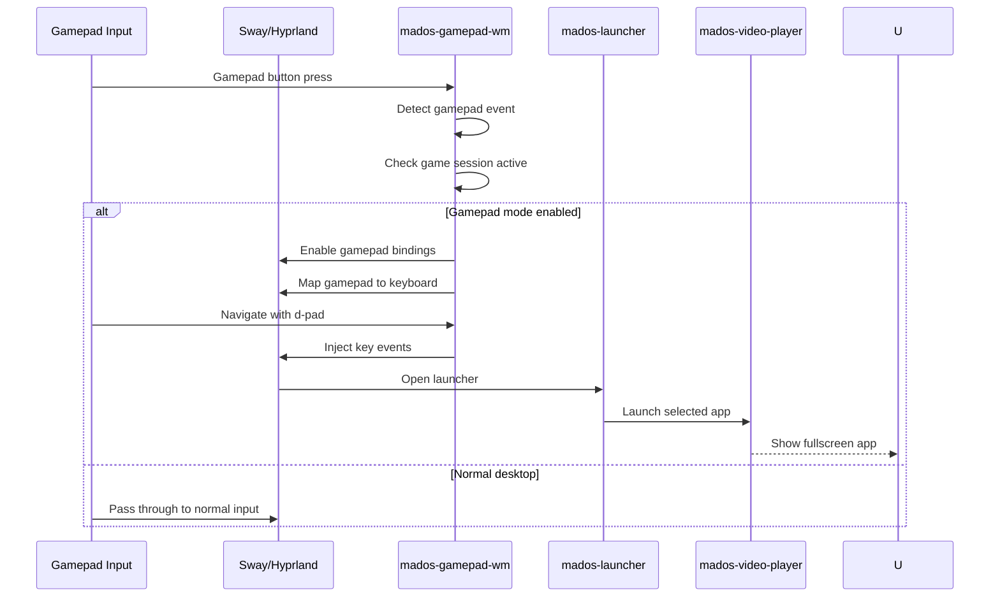

# Sequence Diagrams

This document contains sequence diagrams for key madOS workflows.

## ISO Build Process

## Live USB Boot Process

## Installer Launch Flow

## First Boot Setup (OpenCode/Ollama)

## USB Persistence Detection

## Desktop App Launch (Gamepad Mode)

